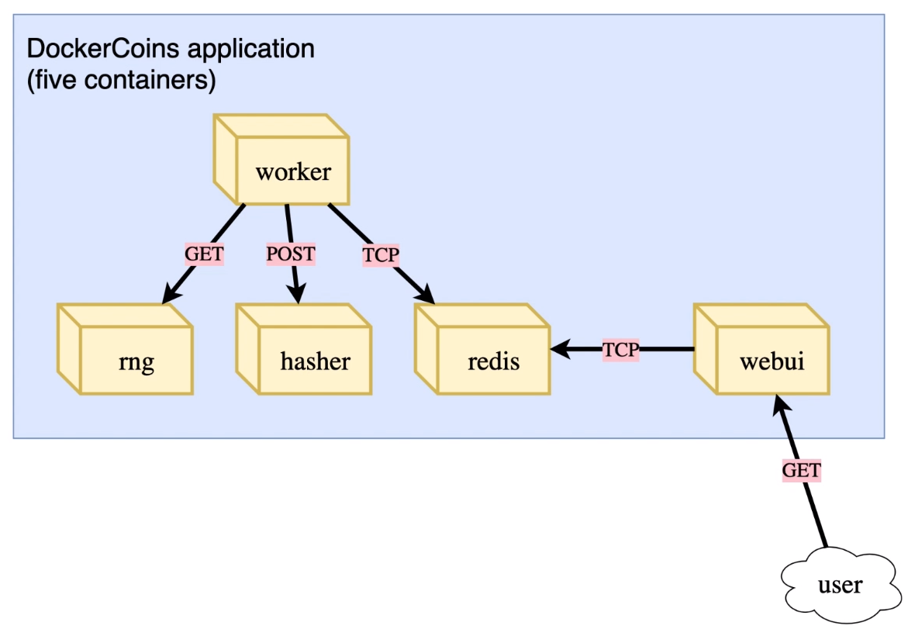
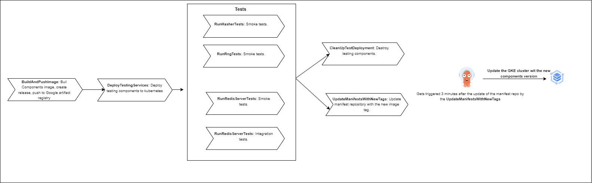

DockerCoins Application with CI/CD based on ArgoCD tool.


App architecture




CI/CD part:

In order to implement the application you must first install the ArgoCD application into the Kubernetes cluster. The installation is performed by the CI of the repository ArgoCD: https://github.com/AmineBouzayeni/ArgoCD.

1. In order to expose the ArgoCD application locally, you can use Kubectl Port Forwarding. The app will be accessible via `localhost:8080` for example:
    ```
    kubectl port-forward svc/argocd-server -n argocd 8080:443
    ```

2. Login to ArgoCD:
    The username is `admin`. The password can be found using the `get secret` command of kubectl:
    ```
    kubectl get secret argocd-initial-admin-secret -n argocd -o yaml
    ```
    Take the password field value and decode it using a base64 decoder.


Pipeline architecture:



